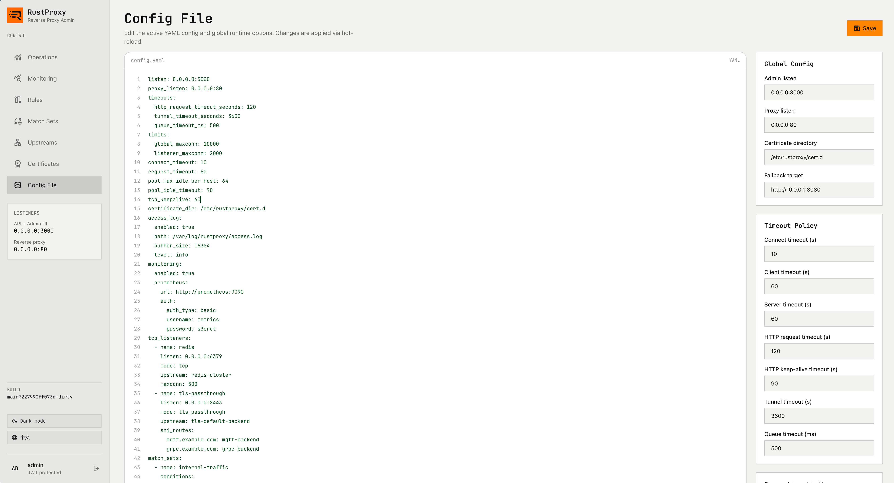
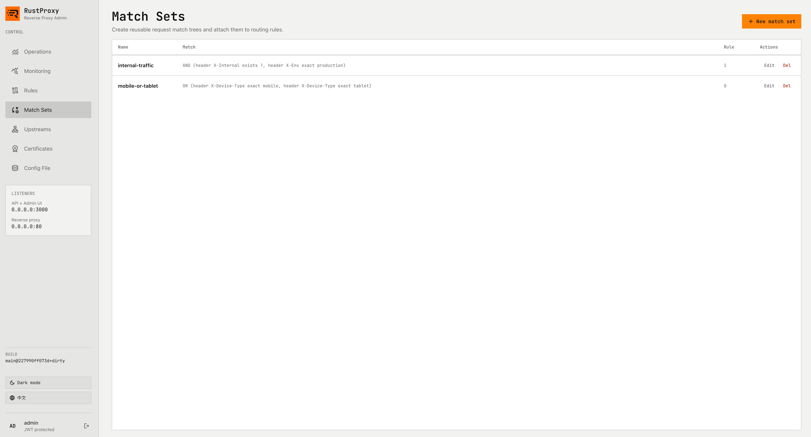
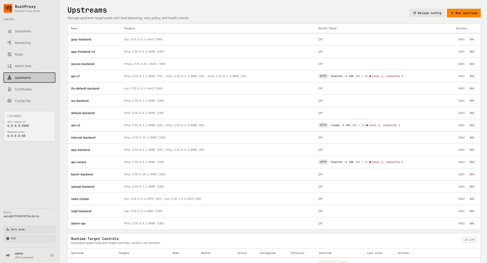
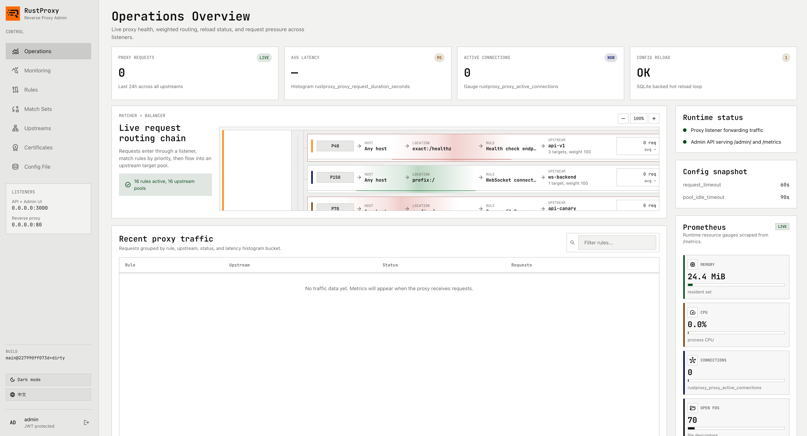

[简体中文](README_zh.md)

# rustproxy

A high-performance reverse proxy and load balancer written in Rust, with a built-in admin dashboard, hot-reloadable configuration, and production-grade traffic management.

## Features

- **Reverse Proxy** — HTTP/HTTPS forwarding with connection pooling (HTTP/1.1, HTTP/2)
- **Load Balancing** — Weighted round robin, least connections, IP hash, consistent hash, URL hash
- **Flexible Routing** — Host matching (exact / wildcard / any), path matching (exact / prefix / regex), header / cookie / JWT conditions, AND/OR boolean expression trees
- **Match Sets** — Reusable condition groups shared across rules
- **Path Manipulation** — Prefix stripping, regex rewrite, HTTP redirects
- **Health Checks** — TCP and HTTP mode with configurable thresholds
- **Retry Policy** — Retry on upstream errors, timeouts, or specific status codes
- **Rate Limiting** — Per IP / host / route with max body size and queue timeout
- **Sticky Sessions** — By client IP, header value, cookie, or JWT claim
- **WebSocket** — Full bidirectional tunneling with configurable timeouts
- **TLS** — Termination and SNI-based passthrough; configurable certificate directory
- **TCP Proxy** — Raw TCP forwarding for databases, message brokers, etc.
- **Admin UI** — Built-in React dashboard for managing upstreams, rules, and runtime state
- **Admin API** — JWT-authenticated REST API for config and runtime operations (enable/disable/drain targets, adjust weights)
- **Hot Reload** — YAML config watched on disk; changes applied without restart
- **CLI Management** — Full config, upstream, and rule management from the command line
- **Prometheus Metrics** — Request counters, duration histograms, active connections, target health
- **Access Logging** — Buffered structured access log with configurable level

## Screenshots

<table>
  <tr>
    <td align="center"><b>Config File</b></td>
    <td align="center"><b>Match Sets</b></td>
  </tr>
  <tr>
    <td></td>
    <td></td>
  </tr>
  <tr>
    <td align="center"><b>Upstreams</b></td>
    <td align="center"><b>Operations</b></td>
  </tr>
  <tr>
    <td></td>
    <td></td>
  </tr>
</table>

## Build

### Prerequisites

- Rust 1.75+ (with `cargo`)
- Node.js 18+ (with `npm`) — for the admin UI
- Git

### From Source

```bash
# Clone the repository
git clone https://github.com/<user>/rustproxy.git
cd rustproxy

# Build (includes UI)
make release

# Or step by step
make ui-deps      # install UI dependencies
make ui-build     # build admin UI
cargo build --release --locked
```

The release binary is at `target/release/rustproxy`.

### Cross-compile for Linux x86_64 (from macOS)

```bash
./scripts/buildx-x86_64.sh
```

### Docker

Pre-built images are available on GitHub Container Registry:

```bash
docker pull ghcr.io/pockyhm/rustproxy:latest
```

## Quick Start with Docker

> **Note:** rustproxy stores all configuration in SQLite (`/var/lib/rustproxy/rustproxy.db`). A YAML file is only needed on the **first run** to bootstrap the initial config. After that, all changes are made via the CLI or Admin UI.

1. Create a `config.yaml` (see [Quick Start](#quick-start) for a minimal example).

2. Run with the config mounted for initial import:

```bash
docker run -d --name rustproxy \
  -p 3000:3000 \
  -p 80:80 \
  -v ./data:/var/lib/rustproxy \
  -v ./config.yaml:/etc/rustproxy/config.yaml:ro \
  ghcr.io/pockyhm/rustproxy:latest
```

The YAML config is imported into the database on first start. Once the database is initialized, subsequent restarts load from SQLite and the YAML mount can be removed.

3. Create an admin user:

```bash
docker exec -it rustproxy rustproxy user add admin
```

4. Open the admin dashboard at `http://localhost:3000`.

Ports: **3000** (admin API / UI), **80** (proxy), **443** (HTTPS).

Or build locally:

```bash
make docker-build
make docker-run CONFIG=config.yaml
```

## Quick Start

1. Create a minimal `config.yaml`:

```yaml
listen: "0.0.0.0:3000"
proxy_listen: "0.0.0.0:80"

fallback:
  url: "http://127.0.0.1:8080"

rules:
  - id: default
    name: Default catch-all
    priority: 1
    upstream: default
    weight: 100

upstreams:
  default:
    name: default
    targets:
      - url: "http://127.0.0.1:8080"
        weight: 100
```

2. Add an admin user:

```bash
rustproxy user add admin
```

3. Start the server:

```bash
rustproxy serve config.yaml
```

4. Open the admin dashboard at `http://localhost:3000`.

## Configuration

Configuration is loaded from a YAML file and stored in an SQLite database. On first run with a YAML file, the config is imported automatically. Changes to the YAML file are watched and hot-reloaded.

### Global Settings

| Key | Default | Description |
|---|---|---|
| `listen` | `0.0.0.0:3000` | Admin API / UI listen address |
| `proxy_listen` | `0.0.0.0:80` | Default proxy listen address |
| `pool_max_idle_per_host` | `64` | Max idle connections per upstream host |
| `pool_idle_timeout` | `90` | Idle connection timeout (seconds) |
| `tcp_keepalive` | `60` | TCP keepalive interval (seconds) |

### Timeouts

```yaml
timeouts:
  connect_timeout_seconds: 10
  client_timeout_seconds: 60
  server_timeout_seconds: 60
  http_request_timeout_seconds: 120
  http_keepalive_timeout_seconds: 90
  tunnel_timeout_seconds: 3600
  queue_timeout_ms: 500
```

All timeout values can be overridden per-rule.

### Connection Limits

```yaml
limits:
  global_maxconn: 10000
  listener_maxconn: 2000
```

### Routing Rules

Rules are evaluated by **priority** (highest first). Each rule specifies how to match a request and where to send it.

```yaml
rules:
  - id: api-v2
    name: API v2
    priority: 100
    host:
      type: exact
      value: api.example.com
    location:
      type: prefix
      value: /v2/
    upstream: api-v2
    weight: 100
    header_policy:
      request:
        - op: set
          name: X-Forwarded-Prefix
          value: /v2
      response:
        - op: set
          name: X-RateLimit-Policy
          value: api-default
    path_actions:
      - strip_prefix:
          prefix: /v2
    limit_policy:
      rate_per_second: 100
      rate_key: ip
      max_body_bytes: 1048576
    timeouts:
      server_timeout_seconds: 30
```

#### Host Matching

| Type | Behavior |
|---|---|
| `any` | Matches any host (default) |
| `exact` | Exact string match |
| `wildcard` | Glob pattern, e.g. `*.example.com` |

#### Path Matching

| Type | Behavior |
|---|---|
| `exact` | Exact path match |
| `prefix` | Prefix match (default) |
| `regex` | Regex match |

#### Conditions

Conditions can be nested with AND/OR logic:

```yaml
conditions:
  type: and
  children:
    - type: leaf
      conditionType: header
      key: X-Internal
      operator: exists
    - type: leaf
      conditionType: header
      key: X-Env
      operator: exact
      value: production
```

Supported condition types: `header`, `cookie`, `jwt`, `host`, `path`.

Supported operators: `exact`, `prefix`, `regex`, `exists`, `contains`.

For JWT conditions, use `claim_path` instead of `key` to navigate nested claims (e.g. `roles` or `tenant.id`).

#### Match Sets

Define reusable condition groups:

```yaml
match_sets:
  - name: internal-traffic
    conditions:
      type: and
      children:
        - type: leaf
          conditionType: header
          key: X-Internal
          operator: exists
```

Reference in a rule:

```yaml
rules:
  - id: internal-route
    match_set: internal-traffic
    upstream: internal-backend
```

#### Dedicated Listeners

Bind a rule to its own port:

```yaml
rules:
  - id: admin-port
    name: Admin API
    priority: 200
    listen: "0.0.0.0:9090"
    upstream: admin-api
```

### Upstreams

```yaml
upstreams:
  api-v1:
    name: api-v1
    balance: weighted_round_robin    # or least_connections, ip_hash, consistent_hash, url_hash
    targets:
      - url: "http://10.0.1.1:8080"
        weight: 70
      - url: "http://10.0.1.2:8080"
        weight: 30
    health_check:
      enabled: true
      mode: http                     # or tcp
      path: /healthz
      expected_status: 200
      interval_seconds: 10
      timeout_seconds: 3
      healthy_threshold: 2
      unhealthy_threshold: 3
    retry:
      attempts: 2
      retry_on_status: [502, 503]
      retry_on_timeout: true
      retry_on_connect_error: true
    sticky:
      enabled: true
      source:
        type: cookie                 # or ip, header, jwt_claim
        name: session_id
      ttl_seconds: 3600
      cookie:
        name: RS_STICKY
        path: /
        secure: true
        http_only: true
        same_site: strict
```

### TCP Listeners

Forward raw TCP or route TLS by SNI:

```yaml
tcp_listeners:
  - name: redis
    listen: "0.0.0.0:6379"
    mode: tcp
    upstream: redis-cluster
    maxconn: 500

  - name: tls-passthrough
    listen: "0.0.0.0:8443"
    mode: tls_passthrough
    upstream: tls-default-backend
    sni_routes:
      grpc.example.com: grpc-backend
      mqtt.example.com: mqtt-backend
```

TCP upstream targets use the `tcp://host:port` scheme:

```yaml
upstreams:
  redis-cluster:
    targets:
      - url: "tcp://10.1.0.1:6379"
        weight: 50
      - url: "tcp://10.1.0.2:6379"
        weight: 50
    balance: least_connections
```

### Access Log

```yaml
access_log:
  enabled: true
  path: "/var/log/rustproxy/access.log"
  buffer_size: 16384
  level: info
```

### Monitoring

```yaml
monitoring:
  enabled: true
  prometheus:
    url: "http://prometheus:9090"
    auth:
      auth_type: basic
      username: metrics
      password: s3cret
```

### Fallback

When no rule matches, the fallback upstream is used:

```yaml
fallback:
  url: "http://10.0.0.1:8080"
```

Use `url: "404"` to return a 404 page instead of proxying.

## CLI Reference

```bash
# Start the proxy
rustproxy serve [config.yaml]

# Manage configuration
rustproxy config get [key]
rustproxy config set <key> <value>
rustproxy config export
rustproxy config import <file> [--replace]
rustproxy config edit

# Manage upstreams
rustproxy config upstream list
rustproxy config upstream add <name> --url <url> [--weight 100]
rustproxy config upstream add-target <name> --url <url> [--weight 100]
rustproxy config upstream delete <name>

# Manage rules
rustproxy config rule list
rustproxy config rule add <id> --name <name> --upstream <upstream> [options]
rustproxy config rule delete <id>

# Manage users
rustproxy user add <username>
rustproxy user list
rustproxy user passwd <username>
```

## Admin API

The admin API is available on the `listen` port and requires JWT authentication.

| Method | Endpoint | Description |
|---|---|---|
| GET | `/api/runtime/upstreams` | List upstreams with runtime state |
| POST | `/api/runtime/upstreams/:name/targets/enable` | Enable a target |
| POST | `/api/runtime/upstreams/:name/targets/disable` | Disable a target |
| POST | `/api/runtime/upstreams/:name/targets/drain` | Drain a target |
| POST | `/api/runtime/upstreams/:name/targets/weight` | Override target weight |
| GET | `/api/runtime/stick-table` | View sticky session bindings |

## Architecture

```
┌─────────────┐     ┌──────────────────────────────────────────┐
│   Client     │────▶│  rustproxy                               │
└─────────────┘     │                                          │
                    │  ┌──────────┐  ┌──────────┐             │
                    │  │ Listener │  │ Listener │ ...         │
                    │  │  :80     │  │  :9090   │             │
                    │  └────┬─────┘  └────┬─────┘             │
                    │       │              │                    │
                    │  ┌────▼──────────────▼────┐              │
                    │  │    Rule Matcher         │              │
                    │  │  (priority, host, path, │              │
                    │  │   conditions)            │              │
                    │  └────────────┬────────────┘              │
                    │               │                           │
                    │  ┌────────────▼────────────┐              │
                    │  │    Balancer              │              │
                    │  │  (WRR / least_conn /    │              │
                    │  │   ip_hash / ...)         │              │
                    │  └────────────┬────────────┘              │
                    │               │                           │
                    │  ┌────────────▼────────────┐              │
                    │  │  Connection Pool + Retry │              │
                    │  └────────────┬────────────┘              │
                    │               │                           │
                    │       ┌───────▼───────┐                   │
                    │       │   Upstream    │                   │
                    │       │  Backends     │                   │
                    │       └───────────────┘                   │
                    │                                          │
                    │  ┌──────────┐  ┌──────────────┐          │
                    │  │ Admin UI │  │ Admin API     │          │
                    │  │  :3000   │  │ (JWT auth)    │          │
                    │  └──────────┘  └──────────────┘          │
                    └──────────────────────────────────────────┘
```

## License

MIT
