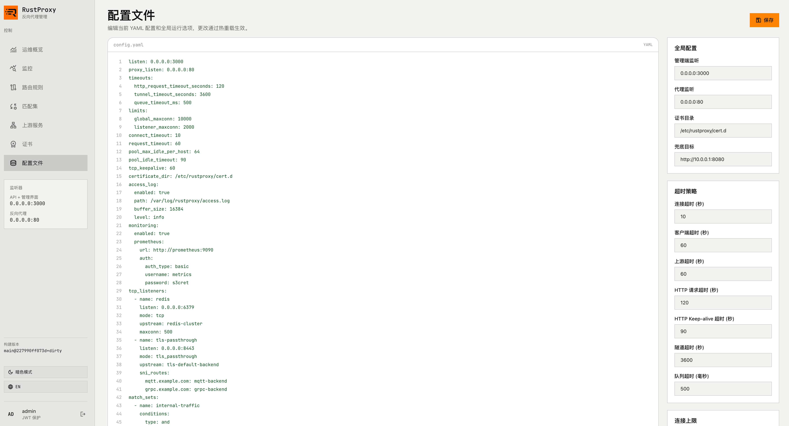
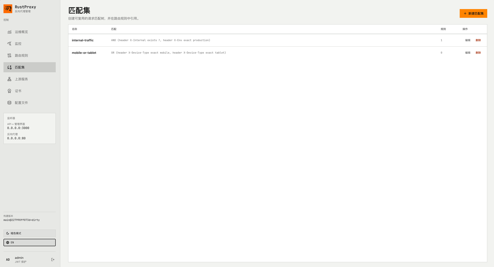
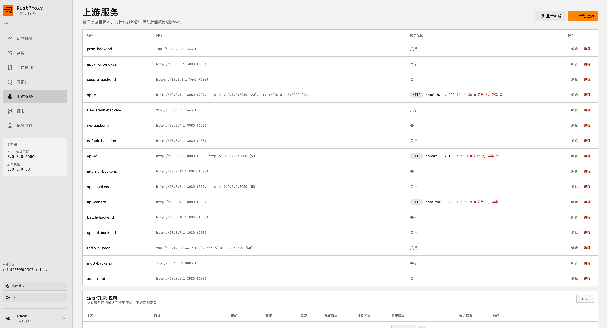
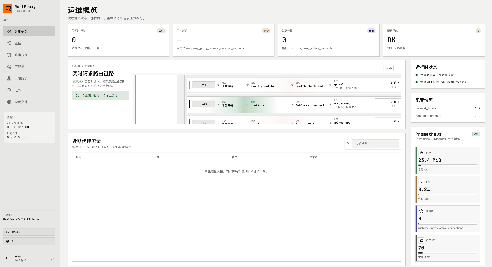

[English](README.md)

# rustproxy

使用 Rust 编写的高性能反向代理与负载均衡器，内置管理控制台、热重载配置以及生产级流量管理能力。

## 功能特性

- **反向代理** — 支持 HTTP/HTTPS 转发，连接池复用（HTTP/1.1、HTTP/2）
- **负载均衡** — 加权轮询、最少连接、IP 哈希、一致性哈希、URL 哈希
- **灵活路由** — 主机匹配（精确 / 通配符 / 任意）、路径匹配（精确 / 前缀 / 正则）、Header / Cookie / JWT 条件，支持 AND/OR 布尔表达式组合
- **匹配集** — 可复用的条件组，多条规则共享
- **路径操作** — 前缀剥离、正则重写、HTTP 重定向
- **健康检查** — 支持 TCP 和 HTTP 模式，可配置健康/不健康阈值
- **重试策略** — 支持上游错误、超时或特定状态码自动重试
- **限流** — 按客户端 IP / 主机 / 路由限流，支持请求体大小限制与排队超时
- **会话保持** — 基于客户端 IP、Header、Cookie 或 JWT Claim 的粘性会话
- **WebSocket** — 完整双向隧道，可配置超时
- **TLS** — 支持终止和基于 SNI 的透传模式；可配置证书目录
- **TCP 代理** — 原始 TCP 转发，适用于数据库、消息队列等
- **管理界面** — 内置 React 控制台，可视化管理上游、规则和运行时状态
- **管理 API** — JWT 认证的 REST API，支持配置管理和运行时操作（启用/禁用/排空目标、调整权重）
- **热重载** — 监听 YAML 配置文件变化，无需重启即可生效
- **命令行管理** — 通过 CLI 完整管理配置、上游和规则
- **Prometheus 指标** — 请求计数、耗时直方图、活跃连接数、目标健康状态
- **访问日志** — 带缓冲的结构化访问日志，可配置日志级别

## 截图

<table>
  <tr>
    <td align="center"><b>配置文件</b></td>
    <td align="center"><b>匹配集</b></td>
  </tr>
  <tr>
    <td></td>
    <td></td>
  </tr>
  <tr>
    <td align="center"><b>上游管理</b></td>
    <td align="center"><b>运维操作</b></td>
  </tr>
  <tr>
    <td></td>
    <td></td>
  </tr>
</table>

## 构建

### 前置条件

- Rust 1.75+（含 `cargo`）
- Node.js 18+（含 `npm`）— 用于构建管理界面
- Git

### 从源码构建

```bash
# 克隆仓库
git clone https://github.com/<user>/rustproxy.git
cd rustproxy

# 构建（包含 UI）
make release

# 或分步执行
make ui-deps      # 安装 UI 依赖
make ui-build     # 构建管理界面
cargo build --release --locked
```

Release 二进制文件位于 `target/release/rustproxy`。

### 从 macOS 交叉编译 Linux x86_64

```bash
./scripts/buildx-x86_64.sh
```

### Docker

预构建镜像已发布到 GitHub Container Registry：

```bash
docker pull ghcr.io/pockyhm/rustproxy:latest
```

## 使用 Docker 快速启动

1. 创建 `config.yaml`（参考下方「快速开始」中的最小配置示例）。

2. 运行：

```bash
docker run -d --name rustproxy \
  -p 3000:3000 \
  -p 80:80 \
  -v ./data:/var/lib/rustproxy \
  -v ./config.yaml:/etc/rustproxy/config.yaml:ro \
  ghcr.io/pockyhm/rustproxy:latest
```

3. 创建管理员用户：

```bash
docker exec -it rustproxy rustproxy user add admin
```

4. 打开管理控制台：`http://localhost:3000`。

端口说明：**3000**（管理 API / UI）、**80**（代理）、**443**（HTTPS）。

或本地构建：

```bash
make docker-build
make docker-run CONFIG=config.yaml
```

## 快速开始

1. 创建最小配置 `config.yaml`：

```yaml
listen: "0.0.0.0:3000"
proxy_listen: "0.0.0.0:80"

fallback:
  url: "http://127.0.0.1:8080"

rules:
  - id: default
    name: 默认兜底
    priority: 1
    upstream: default
    weight: 100

upstreams:
  default:
    name: default
    targets:
      - url: "http://127.0.0.1:8080"
        weight: 100
```

2. 添加管理员用户：

```bash
rustproxy user add admin
```

3. 启动服务：

```bash
rustproxy serve config.yaml
```

4. 打开管理控制台：`http://localhost:3000`。

## 配置说明

配置从 YAML 文件加载并存储在 SQLite 数据库中。首次运行使用 YAML 文件时，配置会自动导入。YAML 文件的变更会被监听并热重载。

### 全局设置

| 键 | 默认值 | 说明 |
|---|---|---|
| `listen` | `0.0.0.0:3000` | 管理 API / UI 监听地址 |
| `proxy_listen` | `0.0.0.0:80` | 默认代理监听地址 |
| `pool_max_idle_per_host` | `64` | 每个上游主机的最大空闲连接数 |
| `pool_idle_timeout` | `90` | 空闲连接超时（秒） |
| `tcp_keepalive` | `60` | TCP Keepalive 间隔（秒） |

### 超时配置

```yaml
timeouts:
  connect_timeout_seconds: 10
  client_timeout_seconds: 60
  server_timeout_seconds: 60
  http_request_timeout_seconds: 120
  http_keepalive_timeout_seconds: 90
  tunnel_timeout_seconds: 3600
  queue_timeout_ms: 500
```

所有超时值均可在规则级别覆盖。

### 连接限制

```yaml
limits:
  global_maxconn: 10000
  listener_maxconn: 2000
```

### 路由规则

规则按 **优先级** 评估（最高优先）。每条规则指定如何匹配请求以及转发到哪里。

```yaml
rules:
  - id: api-v2
    name: API v2
    priority: 100
    host:
      type: exact
      value: api.example.com
    location:
      type: prefix
      value: /v2/
    upstream: api-v2
    weight: 100
    header_policy:
      request:
        - op: set
          name: X-Forwarded-Prefix
          value: /v2
      response:
        - op: set
          name: X-RateLimit-Policy
          value: api-default
    path_actions:
      - strip_prefix:
          prefix: /v2
    limit_policy:
      rate_per_second: 100
      rate_key: ip
      max_body_bytes: 1048576
    timeouts:
      server_timeout_seconds: 30
```

#### 主机匹配

| 类型 | 行为 |
|---|---|
| `any` | 匹配任意主机（默认） |
| `exact` | 精确匹配 |
| `wildcard` | 通配符匹配，如 `*.example.com` |

#### 路径匹配

| 类型 | 行为 |
|---|---|
| `exact` | 精确路径匹配 |
| `prefix` | 前缀匹配（默认） |
| `regex` | 正则匹配 |

#### 条件

条件支持 AND/OR 嵌套逻辑：

```yaml
conditions:
  type: and
  children:
    - type: leaf
      conditionType: header
      key: X-Internal
      operator: exists
    - type: leaf
      conditionType: header
      key: X-Env
      operator: exact
      value: production
```

支持的条件类型：`header`、`cookie`、`jwt`、`host`、`path`。

支持的运算符：`exact`、`prefix`、`regex`、`exists`、`contains`。

JWT 条件使用 `claim_path` 替代 `key` 来导航嵌套声明（如 `roles` 或 `tenant.id`）。

#### 匹配集

定义可复用的条件组：

```yaml
match_sets:
  - name: internal-traffic
    conditions:
      type: and
      children:
        - type: leaf
          conditionType: header
          key: X-Internal
          operator: exists
```

在规则中引用：

```yaml
rules:
  - id: internal-route
    match_set: internal-traffic
    upstream: internal-backend
```

#### 独立监听器

为规则绑定独立端口：

```yaml
rules:
  - id: admin-port
    name: 管理 API
    priority: 200
    listen: "0.0.0.0:9090"
    upstream: admin-api
```

### 上游配置

```yaml
upstreams:
  api-v1:
    name: api-v1
    balance: weighted_round_robin    # 或 least_connections, ip_hash, consistent_hash, url_hash
    targets:
      - url: "http://10.0.1.1:8080"
        weight: 70
      - url: "http://10.0.1.2:8080"
        weight: 30
    health_check:
      enabled: true
      mode: http                     # 或 tcp
      path: /healthz
      expected_status: 200
      interval_seconds: 10
      timeout_seconds: 3
      healthy_threshold: 2
      unhealthy_threshold: 3
    retry:
      attempts: 2
      retry_on_status: [502, 503]
      retry_on_timeout: true
      retry_on_connect_error: true
    sticky:
      enabled: true
      source:
        type: cookie                 # 或 ip, header, jwt_claim
        name: session_id
      ttl_seconds: 3600
      cookie:
        name: RS_STICKY
        path: /
        secure: true
        http_only: true
        same_site: strict
```

### TCP 监听器

转发原始 TCP 或基于 SNI 路由 TLS：

```yaml
tcp_listeners:
  - name: redis
    listen: "0.0.0.0:6379"
    mode: tcp
    upstream: redis-cluster
    maxconn: 500

  - name: tls-passthrough
    listen: "0.0.0.0:8443"
    mode: tls_passthrough
    upstream: tls-default-backend
    sni_routes:
      grpc.example.com: grpc-backend
      mqtt.example.com: mqtt-backend
```

TCP 上游目标使用 `tcp://host:port` 格式：

```yaml
upstreams:
  redis-cluster:
    targets:
      - url: "tcp://10.1.0.1:6379"
        weight: 50
      - url: "tcp://10.1.0.2:6379"
        weight: 50
    balance: least_connections
```

### 访问日志

```yaml
access_log:
  enabled: true
  path: "/var/log/rustproxy/access.log"
  buffer_size: 16384
  level: info
```

### 监控

```yaml
monitoring:
  enabled: true
  prometheus:
    url: "http://prometheus:9090"
    auth:
      auth_type: basic
      username: metrics
      password: s3cret
```

### 兜底配置

当没有任何规则匹配时，使用兜底上游：

```yaml
fallback:
  url: "http://10.0.0.1:8080"
```

使用 `url: "404"` 将返回 404 页面而不是代理转发。

## 命令行参考

```bash
# 启动代理
rustproxy serve [config.yaml]

# 管理配置
rustproxy config get [key]
rustproxy config set <key> <value>
rustproxy config export
rustproxy config import <file> [--replace]
rustproxy config edit

# 管理上游
rustproxy config upstream list
rustproxy config upstream add <name> --url <url> [--weight 100]
rustproxy config upstream add-target <name> --url <url> [--weight 100]
rustproxy config upstream delete <name>

# 管理规则
rustproxy config rule list
rustproxy config rule add <id> --name <name> --upstream <upstream> [options]
rustproxy config rule delete <id>

# 管理用户
rustproxy user add <username>
rustproxy user list
rustproxy user passwd <username>
```

## 管理 API

管理 API 在 `listen` 端口上提供，需要 JWT 认证。

| 方法 | 端点 | 说明 |
|---|---|---|
| GET | `/api/runtime/upstreams` | 列出上游及运行时状态 |
| POST | `/api/runtime/upstreams/:name/targets/enable` | 启用目标 |
| POST | `/api/runtime/upstreams/:name/targets/disable` | 禁用目标 |
| POST | `/api/runtime/upstreams/:name/targets/drain` | 排空目标（等待现有连接结束） |
| POST | `/api/runtime/upstreams/:name/targets/weight` | 覆盖目标权重 |
| GET | `/api/runtime/stick-table` | 查看粘性会话绑定 |

## 架构

```
┌─────────────┐     ┌──────────────────────────────────────────┐
│    客户端    │────▶│  rustproxy                               │
└─────────────┘     │                                          │
                    │  ┌──────────┐  ┌──────────┐             │
                    │  │  监听器  │  │  监听器  │ ...         │
                    │  │  :80     │  │  :9090   │             │
                    │  └────┬─────┘  └────┬─────┘             │
                    │       │              │                    │
                    │  ┌────▼──────────────▼────┐              │
                    │  │    规则匹配器           │              │
                    │  │  (优先级、主机、路径、   │              │
                    │  │   条件)                 │              │
                    │  └────────────┬────────────┘              │
                    │               │                           │
                    │  ┌────────────▼────────────┐              │
                    │  │    负载均衡器            │              │
                    │  │  (加权轮询 / 最少连接 /  │              │
                    │  │   IP哈希 / ...)          │              │
                    │  └────────────┬────────────┘              │
                    │               │                           │
                    │  ┌────────────▼────────────┐              │
                    │  │  连接池 + 重试           │              │
                    │  └────────────┬────────────┘              │
                    │               │                           │
                    │       ┌───────▼───────┐                   │
                    │       │   上游后端    │                   │
                    │       └───────────────┘                   │
                    │                                          │
                    │  ┌──────────┐  ┌──────────────┐          │
                    │  │ 管理界面 │  │ 管理 API     │          │
                    │  │  :3000   │  │ (JWT 认证)   │          │
                    │  └──────────┘  └──────────────┘          │
                    └──────────────────────────────────────────┘
```

## 许可证

MIT
